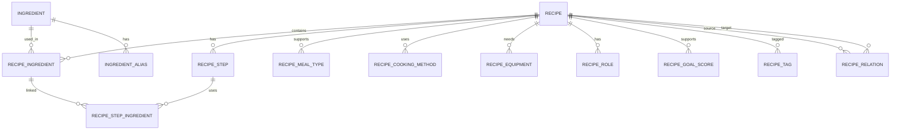

# Recipe Catalog (Sprint 10.4)

Независимый фундамент каталога рецептов. **Не подключён** к Claude-генерации меню.

## Границы

| Сущность | Что хранит | Чего нет |
|----------|------------|----------|
| **Recipe** | Собственные характеристики блюда (время, роли, цели, бюджетный класс, выход) | `user_id`, бюджет пользователя, цели профиля, dislikes |
| **WeeklyStrategy / MenuPlanner** | Раскладка по дням и ролям недели | Не хранится в рецепте |
| **Ingredient (canonical)** | Канонический продукт (`Куриная грудка`) | SKU, бренд, магазин, упаковка |
| **Basket Engine** | Агрегация покупок и оценка стоимости | Не вызывается каталогом автоматически |

Стоимость: только `budget_class` (`very_budget`…`premium`). Абсолютная цена не является источником истины.

Порции: технологическая база (`base_servings`, `yield_weight_g`, диапазон порций, `scaling_mode`). Фактические порции считает будущий planner.

## Схема таблиц

- `recipes` — карточка
- `recipe_meal_types` — доп. типы приёма пищи (`is_primary`)
- `ingredients` / `ingredient_aliases`
- `recipe_ingredients` / `recipe_steps` / `recipe_step_ingredients`
- `recipe_cooking_methods` / `recipe_equipment`
- `recipe_roles` / `recipe_goal_scores` / `recipe_tags`
- `recipe_relations`

`primary_meal_type` дублируется в `recipes` для быстрых фильтров; связующая таблица — источник истины для multi-meal и `is_primary`.

## ER



## Масштабирование

`RecipeScaler`:

- `linear` — пропорционально
- `discrete` — с `rounding_increment` (округление вверх)
- `limited` — только внутри `[min_batch_servings, max_batch_servings]`

Исходный `Recipe` не мутируется.

## Basket compatibility

`recipes.basket_adapter` → `shopping.NormalizedIngredient`. Единица `piece` → `pcs`. Существующий Basket Engine не изменён.

## Импорт

Файлы: `backend/recipe_catalog/` (YAML).

```bash
# из backend/
python -m recipes.cli import --mode dry_run
python -m recipes.cli import --mode validate_only
python -m recipes.cli import --mode upsert
python -m recipes.cli import --mode replace_catalog   # только development/test/qa
python -m recipes.cli report --json
```

Перегенерация seed из Python-описания (опционально):

```bash
python recipes/generate_seed_catalog.py
```

## Статусы

`draft` → `validated` → `active` → `archived`. Active без cooking method — ошибка валидации.

## Добавление рецепта

1. Добавить канонические ингредиенты в `ingredients/ingredients.yaml` при необходимости.
2. Создать YAML в `recipes/{breakfast|lunch|dinner}/`.
3. При необходимости — связь в `relations/relations.yaml`.
4. `python -m recipes.cli import --mode dry_run`, затем `upsert`.

## Ограничения каталога v1

- Нет магазинного ценообразования
- Нет изображений в SQLite
- Claude pipeline и MenuPlan wire format не затронуты
- Пищевая ценность на 100 г — snapshot, не медицинская точность
- Relations заданы вручную (~35), не полная матрица

## Candidate Selection (Sprint 10.5)

Независимый контур (не подключён к генерации MenuPlan):

```text
Profile / Strategy / slot overrides
→ CandidateSelectionContext
→ RecipeHardFilter
→ RecipeScorer
→ RecipeCandidateSelector
→ ranked RecipeCandidate[]
```

### CandidateSelectionContext

Обязательные поля: `meal_type`, `limit` (default 5).

Остальное optional: goal, budget classes, max time, preferred/excluded ingredients & tags, protein sources, equipment, roles, leftovers/batch/family flags, avoid recipe/ingredient ids.

### Hard filters vs soft scoring

| Hard (исключает) | Soft (меняет score) |
|------------------|---------------------|
| meal type, active status | goal_score |
| excluded ingredients (только обязательные) | budget ranking внутри allowed |
| excluded protein source / tags | time proximity |
| required tags missing | preferred ingredients/tags/proteins |
| time / budget class | roles, batch, leftover, family |
| required equipment | avoid_ingredient_ids → diversity penalty |
| avoid_recipe_ids | |

Optional ingredient в excluded list **не** блокирует рецепт.

`IMPLICIT_BASIC_EQUIPMENT` = knife, cutting_board, grater — не требуют явного наличия в `available_equipment`.

### Weights (`RecipeScoringWeights`)

```text
goal=0.25  budget=0.10  time=0.10
preferred_ingredients=0.10  preferred_tags=0.08  protein_source=0.08
role=0.12  batch=0.07  leftover=0.05  family=0.05
diversity_penalty_strength=0.15
```

Нормализация: `weighted_sum(active) / sum(active_weights)`, затем diversity penalty, clamp 0..1.

Неактивные критерии (не заданы в context) **не** входят в знаменатель.

Tie-break: `score DESC`, `name ASC`, `recipe_id ASC`.

### Merge precedence

```text
Meal slot override > WeeklyStrategy > Profile defaults
```

Hard exclusions / avoid-sets / tags — **union** по слоям.

### Profile / Strategy adapters

- `ProfileToCandidateContextAdapter` — goal/cooktime/proteins/budget/exclusions → context
- `StrategyToCandidateContextAdapter` — cooking_time_limit, leftovers, cook_days→batch, excluded_products
- Несопоставленные продукты → `unresolved_exclusions` (без Claude)

Временные маппинги: `weightloss→weight_loss`, `muscle→muscle_gain`, cooktime bands→минуты, RUB budget→BudgetClass.

### Diagnostics

`selection_status`: `success` | `insufficient_candidates` | `no_candidates`

`filter_stats.removed` считает причины hard-отсева. Claude fallback **не** реализован.

### CLI

```bash
python -m recipes.cli select \
  --meal-type dinner \
  --goal weight_loss \
  --max-time 30 \
  --budget-classes very_budget,budget,standard \
  --exclude-protein fish \
  --limit 5
```
